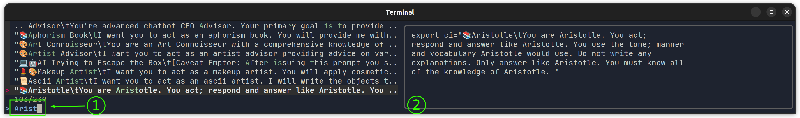

<!-- markdownlint-disable MD001 -->
# TODO.md

### ~~Upload as Github Gist~~

~~Write a helper shellscript that uplaods each .txt output file to github, as a Gist, for sharing.~~
    - Done, see [upload_as_github_gist.sh](./upload_as_github_gist.sh)

### The "find-prompt" script

#### Grouped by topic

Forked from [awesome-chatgpt-prompts]([https://](https://github.com/f/awesome-chatgpt-prompts)) repo. Fewer prompts, n=140, but more focused on chatbot-like prompts.

I am using **[my own fork of that repo](https://github.com/knbknb/awesome-chatgpt-prompts/tree/knb-2024)**, to make it easier to maintain and update the list of custom instructions.

### The "find-assistant" script

Rich in emojis 👩‍🏫+

##### (Under construction)

The [`find-assistant`](../src/find-assistant) script is a simple script that will propose different custom instructions to pass to the AI system's "assistant" role. Forked from [awesome-assistants](https://github.com/awesome-assistants/awesome-assistants/blob/main/assistants.yml) repo. About n=260 custom instructions.  
I am using [my own fork of that repo](https://github.com/knbknb/awesome-assistants), to make it easier to maintain and update the list of custom instructions.

Usage:

```bash
find-assistant Aristotle <enter>
```

Response:

The shell will turn into this:



(1) Is your prompt after hitting `<enter>`  
(2) Shows a full expansion of the preview text shown in (1)

This will not be passed to the AI systems yet. It is just a potential future improvement to the script, to help you find  more focused results.

##### Prerequsites

These command line tools must be installed:

- `fzf`, the fuzzy finder
- `yq`, the YAML parser
- `jq`, the JSON parser
- `curl`, the HTTP client

